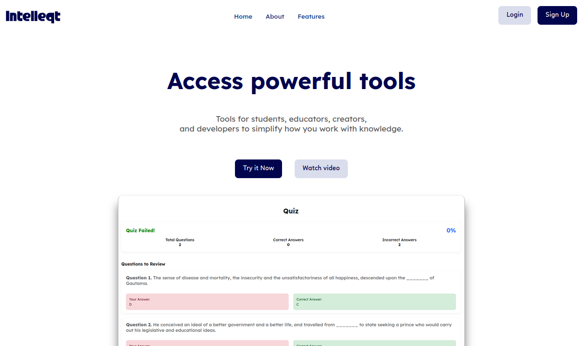

# Intelleqt
A suite of tools for students, educators, creators,
and developers to simplify working with documents.

### Setup
1. pip install the requirements

2. To setup vosk (for transcribing audio), download and unzip from https://alphacephei.com/vosk/models/vosk-model-en-us-0.22-lgraph.zip

Then in the project folder, inside '/backend' folder, create a folder: /models and put the unzipped folder inside.

You should end up with:

root/backend/models/vosk-model-en-us-0.22-lgraph

vosk-model-en-us-0.22-lgraph should contain:
am, conf, graph, etc

3. Install the wordnet lexical English database (wordnet) explicitly, if necessary:
python -m nltk.download('wordnet')
